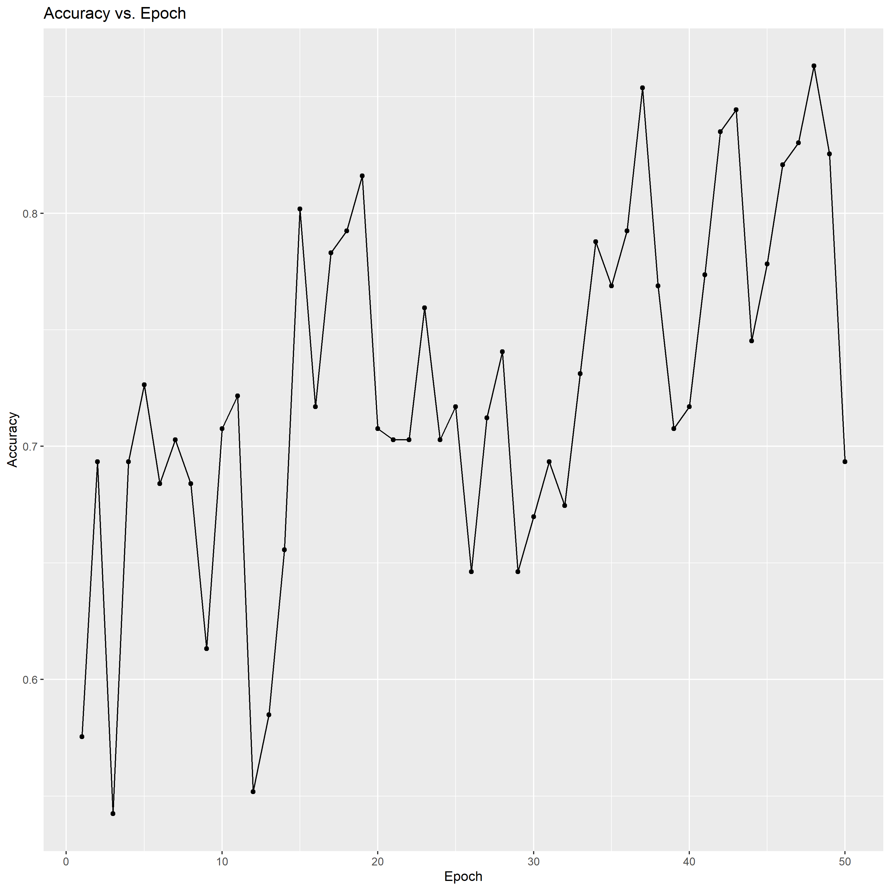
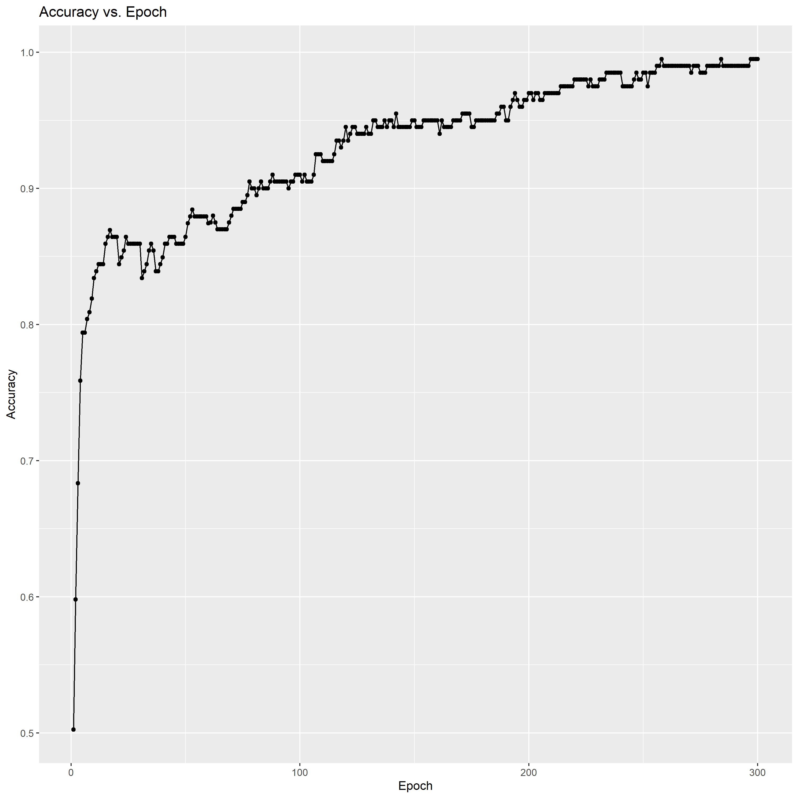
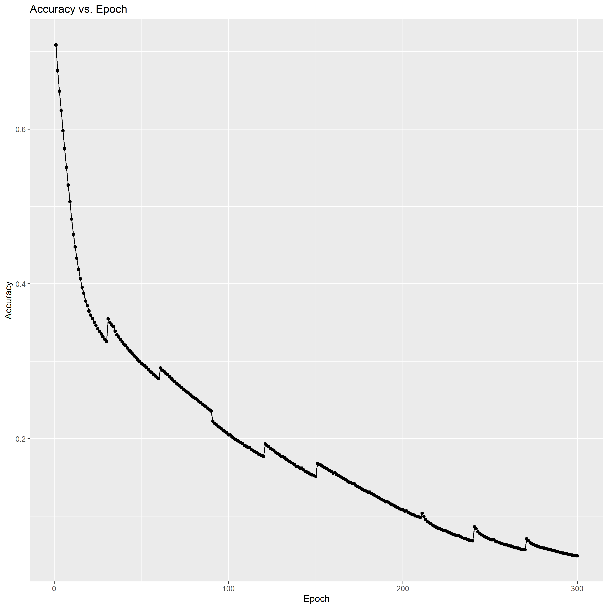
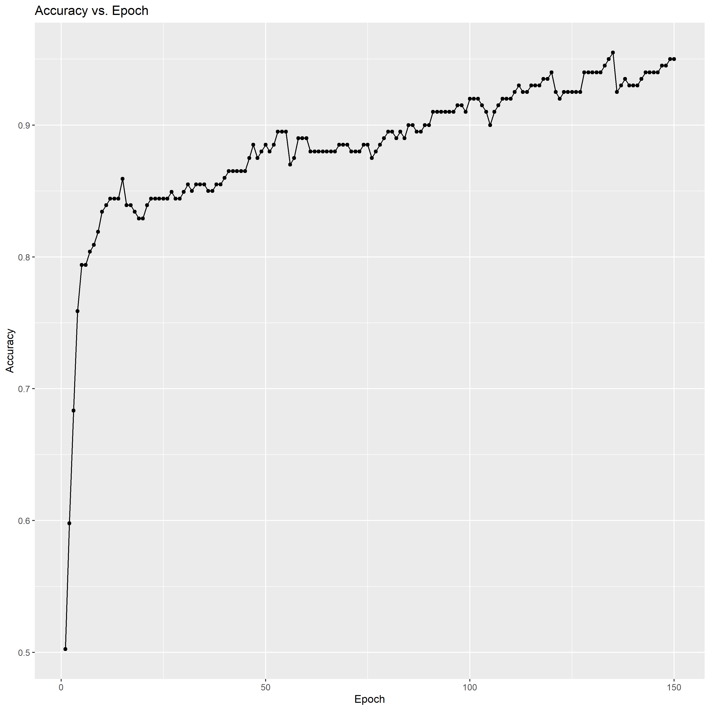

# Heart Disease Prediction 

A keras model trained on the [Heart Disease dataset](https://www.kaggle.com/rashikrahmanpritom/heart-attack-analysis-prediction-dataset) to predict heart disease likelihood for patients.

## Languages

R - Data Science

Python - Model

## Model Structure

|LayerType|Units/Rate|Activation|
|---------|-----|----------|
|Dense|12|relu|
|Dense|64|relu|
|Dense|1|sigmoid|

K-Fold Splits: 10
K-Fold Epochs per Split: 30

Batch Size: 32

Learning Rate: 0.001
Loss: Binary Cross Entropy

## The Task

The task is to accurately identify if a person has a heart disease or not based on their details (such as cholestrol levels, heart rate, and etc.). The model will have to connect all these features and determine the likelihood of the person having a heart disease.

## The Process

First, I began with the EDA of the dataset to identify key patterns for feature extraction. First, I determined which attributes of the dataset were continuous and which were ordinal. The continuous data attributes were graphed in a box plot and I was able to determine that there were outliers in this dataset. This insight provides critical information into the next step and for cleaning the dataset.

I used a Correlation Heat Map to plot the attributes of the dataset against each other. I plotted all the different correlation methods (spearman, kendall, and pearson) and was able to identify that the Pearson method was most effective. This correlates well with our previous knowledge since we know that there are outliers in the data and Pearson correlation implies outliers too. Since the Kendall Correlation is very weak, we know that these attributes are not dependent upon each other.

After viewing the Correlation Heat Map, I was able to easily extract attributes which had an impact on the output. 

After analyzing all the attributes and looking for patterns, I was able to identify that the attribute "fbs" had a minimal impact on the output, so I could remove that attributes from the model training.

I also noticed that the output was unbalanced. There were slightly more values for 1.0 than there were for 0, so I will have to do some sampling when training.

After the EDA, I created a rough model that would serve as the uncleaned model so it can be compared with the newer models to determine progress. This model had an accuracy of around 59%.

As we can see in this graph, the accuracy of the model fluctuated a lot. This can be improved and we can achieve more stable results if we clean the dataset.

First, for the cleaning process, I removed all duplicated values. Then, I removed outliers that exist in the continuous attributes of the data so that they don't mess up our model. Since we know that there are no NA values from the EDA, we don't have anything much left to do.

Next, I had to normalize the data so it was ready for training. I used the SMOTE algorithm to create similar data values for oversampling. After that, I used a StandardScaler to normaize all the attributes in the training inputs.

Now, I was ready to create the model. After looking at the data once more, I realized that the dataset is quite small. As a result, it is difficult to accuracy view the progress of the model while it's training since obtaining a validation dataset would be costly in terms of performance. So, I decided to use K-Fold Validation, a technique for small datasets, to solve this.

First, I used 10 splits and fit the model on 30 epochs for each of the splits. This got an accuracy of 89.5%, which is a HUGE increase from the 59% accuracy from the original uncleaned model.

As we can see in this graph, the model is a LOT more stable than the previous uncleaned one. Here we can see a steady increase in the accuracy while the old model had more of an erratic behavior.

Here we can see that we don't see much of an improvement beyond the 150 epoch mark. The performance slows down and begins to overfit on the training data. I purposely chose such a high number for the number of epochs per validation split so that I can see where the model begins to overfit.

Now we can create a new model that's pretty much identical to the overfitting model, but with different epochs. Instead of the 30 epochs per split, we can use 15 epochs per validation split to ensure that the model doesn't get too tuned to the training dataset.

If we run this model on the test dataset, we see that it's doing quite well. It achieves an accuracy of 91.7%, which is 2% better than the overfitting model and all we had to do was just change the number of epochs.

## Running this Code

In order to run this code on your own machine, start by downloading the dataset from Kaggle and putting it into the "data/heart.csv" file location.

After that, install the necessary python packages from "requirements.txt".

First, run "eda.Rmd", which is all the data analysis and feature extraction. 

Then, run "clean.py". This will clean all the code and put it into the "data/cleaned.csv".

Then, run "normalize.py". This will normalize and put the training data in the "data/final/xs.npy" and "data/final/ys.npy".

After that, run the following files in order:

uncleaned.py
uncleaned.Rmd

overfit.py
overfit.Rmd

optimal.py
optimal.Rmd

After this, the results of all the models will be stored in the "model/" folder.